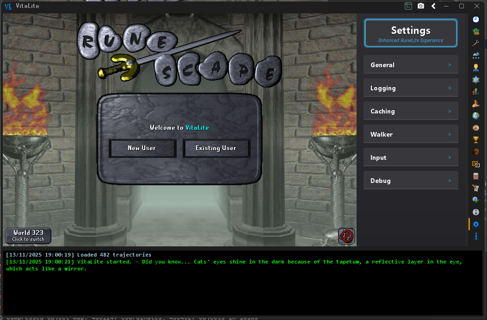

# VitaLite

VitaLite is a launcher and SDK for RuneLite. It loads RuneLite and an injected gamepack, applies mixins, and then starts the client.



## Features

- Access to additional gamepack functionality
- Built-in SDK for plugin development (`base-api/` and `api/`)
- Built-in plugins including Profiles for Jagex Account management (`plugins/`)
- Dual-layered mixin system for modifying RuneLite and gamepack classes
- External plugin side-loading support
- Advanced pathfinding and world walker
- Trajectory-based mouse movement system
- Inter-process communication between clients
- JVM profiler with flame graphs and leak detection

## Quick Start

### For Users

Download the latest release from the VitaLite Launcher:

- https://github.com/Tonic-Box/VitaLauncher/releases

### For Developers

Requirements:

- Java 11

Build and run:

```sh
git clone https://github.com/Tonic-Box/VitaLite.git
cd VitaLite

# Required once per rev update
./gradlew :base-api:syncRuneliteApi

./gradlew buildAndPublishAll
./gradlew run
```

When running from an IDE, use the `com.tonic.VitaLite` main class.

## Documentation

Start here:

- [Documentation Index](docs/index.md)

Key topics:

- [Getting Started](docs/GETTING-STARTED.md)
- [CLI Overview](docs/CLI.md)
- [CLI Reference](docs/cli-reference.md)
- [Configuration](docs/CONFIGURATION.md)
- [Authentication](docs/AUTHENTICATION.md)
- [External Plugins](docs/EXTERNALPLUGIN.md)
- [Injector](docs/INJECTOR.md)
- [Troubleshooting](docs/TROUBLESHOOTING.md)

Feature docs:

- [Features](docs/FEATURES.md)
- [Click Manager](docs/CLICKMANAGER.md)
- [Mouse Movement](docs/MOUSE-MOVEMENT.md)
- [Profiler](docs/PROFILER.md)
- [Script DSL](docs/SCRIPT-DSL.md)

## External Plugins

VitaLite scans for external plugin jars in:

- `${user.home}/.runelite/sideloaded-plugins`
- `${user.home}/.runelite/externalplugins`

See [External Plugins](docs/EXTERNALPLUGIN.md).

## Data and File Locations

VitaLite uses the RuneLite home directory plus a VitaLite subdirectory:

- RuneLite base directory: `${user.home}/.runelite`
- VitaLite directory: `${user.home}/.runelite/vitalite`

## Contributing

1. Fork the repository
2. Create a feature branch
3. Make your changes
4. Test thoroughly
5. Submit a pull request

## Support

- GitHub Issues: https://github.com/Tonic-Box/VitaLite/issues
- Documentation: [docs/index.md](docs/index.md)

## Disclaimer

VitaLite is a third party loader for RuneLite. Use at your own risk. The developers are not responsible for consequences resulting from use of this software.

## License

See [LICENSE](LICENSE) for details.

---

[Buy me a coffee](https://ko-fi.com/tonicbox)
